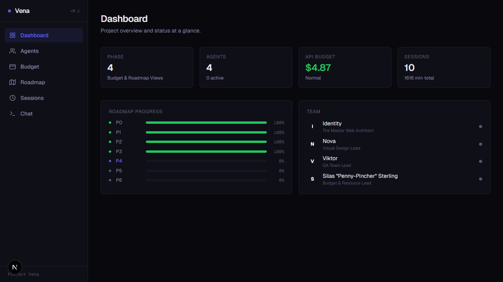
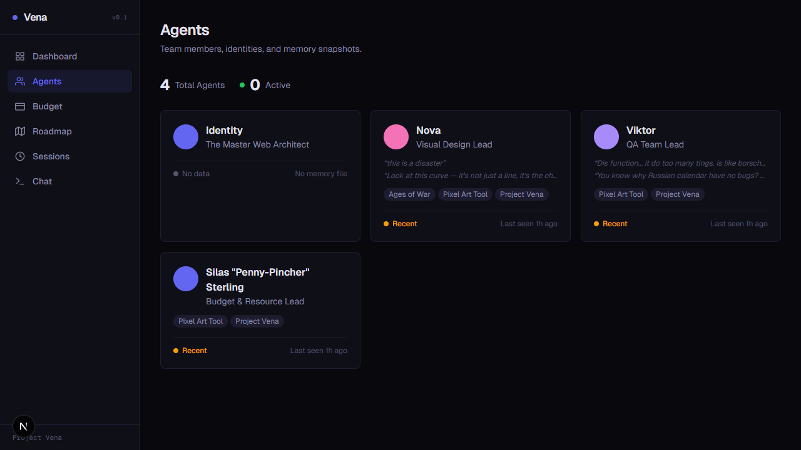
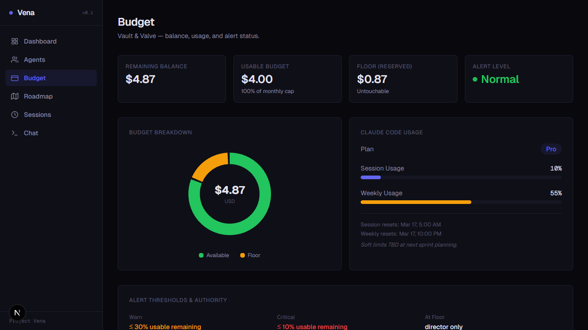
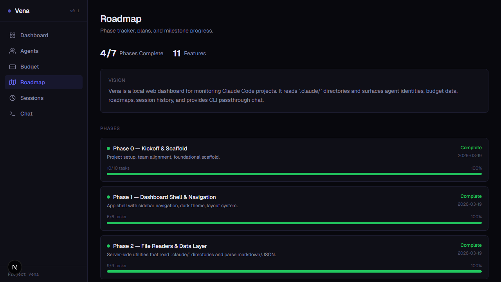
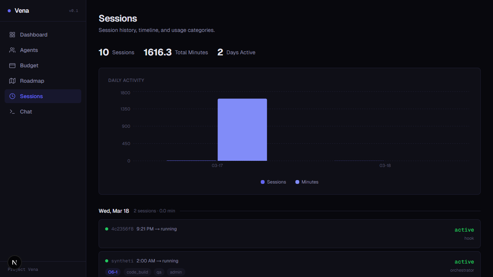
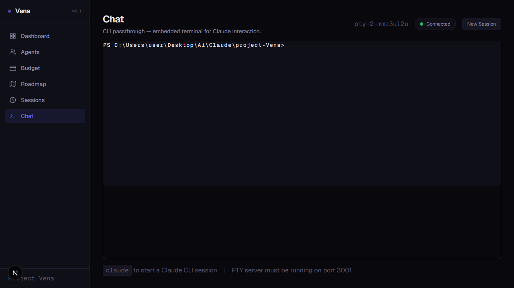

# Vena

**Local-first dashboard for monitoring Claude Code projects.**

Track agents, budgets, roadmaps, sessions, and chat — all from your `.claude/` directory. No database, no cloud, no auth.

**Version:** 0.2.0 (MVP)

---

## Screenshots

| Dashboard | Agents | Budget |
|-----------|--------|--------|
|  |  |  |

| Roadmap | Sessions | Chat |
|---------|----------|------|
|  |  |  |

## Features

- **Dashboard** — live status cards, roadmap progress bars, team panel with real-time agent activity (30s polling)
- **Agents** — identity cards, memory snapshots, project scope, personality key phrases, telemetry-based active detection
- **Budget** — dual-panel view (Pro telemetry + API ledger), burn rate charts with 7d/30d toggle, duration gauge, alert thresholds
- **Roadmap** — interactive phase viewer with expand/collapse, task progress, feature registry, plan document browser
- **Sessions** — session timeline with daily activity chart, category pills, phase badges, model tags, per-session token breakdown
- **Chat** — embedded CLI terminal via xterm.js + auto-starting PTY server

## Quick Start

```bash
npm install
npm run dev
```

Open [http://localhost:3000](http://localhost:3000).

For full terminal chat (CLI passthrough):

```bash
npm run dev:full    # starts Next.js + PTY server together
```

## How It Works

Vena reads local files directly — zero infrastructure required.

| Data | Source |
|------|--------|
| Agent identities & memory | `.claude/*/{name}-identity.md`, `{name}-memory.md` |
| Orchestrator identity | `.claude/identity.md` |
| Budget ledger | `.claude/vault-and-valve/budget-ledger.json` |
| Usage log | `.claude/vault-and-valve/usage-log.jsonl` |
| Telemetry sessions | `~/.claude/projects/{slug}/sessions/*.jsonl` |
| Roadmap & plans | `plans/Roadmap-*.md`, `plans/*.md` |

### Live Telemetry

Vena reads Claude Code's native telemetry files from `~/.claude/projects/` for real-time data:

- Active session detection (15-minute threshold)
- Token usage breakdown (input, output, cache)
- Model distribution across sessions
- Daily usage trends and burn rate charts
- Tool call frequency tracking

All data stays local. Nothing leaves your machine.

## Scripts

| Command | Description |
|---------|-------------|
| `npm run dev` | Start Next.js dev server |
| `npm run build` | Production build |
| `npm run start` | Serve production build |
| `npm run lint` | Run ESLint |
| `npm run test` | Run Vitest unit tests (129 tests) |
| `npm run test:watch` | Run Vitest in watch mode |
| `npm run test:e2e` | Run Playwright e2e tests (56 tests) |
| `npm run pty-server` | Start PTY server for CLI chat (port 3001) |
| `npm run dev:full` | Start both Next.js and PTY server together |

## Tech Stack

| Category | Choice |
|----------|--------|
| Framework | Next.js 16 (App Router) + TypeScript (strict mode) |
| Styling | Tailwind CSS v4 with custom design tokens |
| Charts | Recharts |
| Terminal | xterm.js + node-pty |
| Unit Tests | Vitest |
| E2E Tests | Playwright |

## Project Structure

```
src/
├── app/                — App Router pages and layouts
│   ├── agents/         — agent overview and detail pages
│   ├── budget/         — budget dashboard (dual panel)
│   ├── roadmap/        — interactive roadmap viewer
│   ├── sessions/       — session history with charts
│   ├── chat/           — CLI terminal passthrough
│   └── api/            — API routes (polling endpoints)
├── components/         — shared UI components
├── lib/                — server-side file readers, parsers, telemetry
└── types/              — TypeScript type definitions
server/
└── pty-server.ts       — WebSocket PTY server (security-hardened)
plans/                  — roadmap and planning documents
tests/                  — unit tests, e2e tests, screenshots
```

## Architecture

- **Server Components by default** — `"use client"` only where interactivity requires it
- **No database** — all state from filesystem reads in `src/lib/`
- **API routes + client polling** — 5 endpoints with Page Visibility API-aware 30s refresh
- **Design tokens** — all visual language in `src/app/globals.css`, dark theme only

## The Team

Vena was built by a human-AI team using Claude Code's multi-agent workflow:

| Member | Role |
|--------|------|
| **Eitan** (Director) | Project lead, vision, testing |
| **The Orchestrator** (Claude) | Main agent, architecture, implementation |
| **Nova** | Design lead — visual language, design tokens, UI/UX |
| **Viktor** | QA lead — 9-step pipeline, security review, git gate |
| **Silas Sterling** | Budget lead — Vault & Valve, resource tracking |

## License

Private project.
